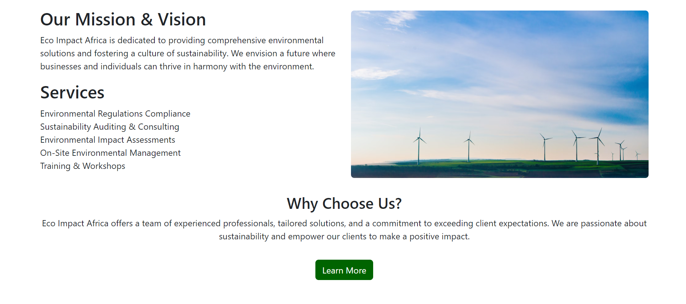
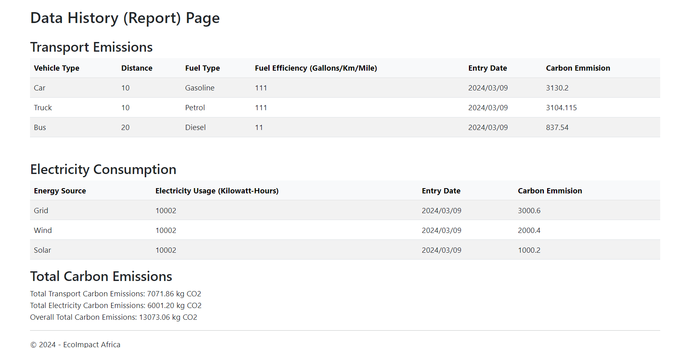

# Eco Impact Africa (EIA) - Carbon Footprint Calculator

Eco Impact Africa (EIA) is a startup organization dedicated to promoting environmental sustainability. Our Carbon Footprint Calculator is designed to help individuals and businesses track and reduce their carbon emissions. This README provides an overview of the project, including how to run it, the technologies used, and a screenshot of the application.

## Authors

- [@Doyma901](https://www.github.com/Doyma901)
- [@filimonkd](https://www.github.com/filimonkd)
- [@awol-90](https://github.com/awol-90)
- [@shewitgebreyesus](https://github.com/shewitgebreyesus)
- [@ebm-ai](https://github.com/ebm-ai)
- [@kidiBelay](https://github.com/KidiBelay)

# Features
- User Authentication
- Data Entry
- Data History: Display of past data entries with details on transportation, electricity usage, and carbon emissions.
- Total Carbon Emissions: Calculation and display of total carbon emissions for both transportation and electricity usage.
- User Interface: Intuitive user interface for easy data entry and visualization of carbon footprint data.
- Data Persistence: Data is stored in JSON format for easy retrieval and manipulation.

# Technologies Used
- Frontend: HTML, CSS, JavaScript
- Backend: C#, ASP.NET
- Database: JSON files
- Libraries/Frameworks: Bootstrap, Newtonsoft.Json
- Authentication: Microsoft.AspNet.Identity
# How to Run the Project
1. Clone this repository to your local machine.
2. Open the project in your preferred development environment (e.g., Visual Studio).
3. Build and run the project.
4. Access the application through your web browser.
# Screenshots

